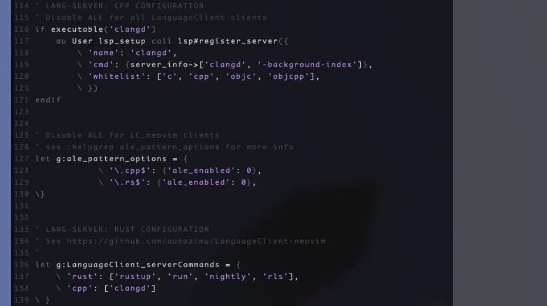

# README

## Not much but still a README! :)

My dotfiles are mainly for me and it's not exactly usable for someone
else yet. I'm focused on support for C++ in NeoVim (and Rust!).

Also, I use zsh with a nice little customized zsh prompt made with the help
from thoughtbot. My zsh configuration doesn't use _oh-my-zsh_ and instead
relies on a few simple shell scripts.

In a normal directory, the prompt looks like:

In a git directory, there's a simple heads-up:

Whenever you `cd` into a new directory, this simply runs `ls` since
that's usually what I do anyway!

I've included plugins pre-installed so the NeoVim config should be
mostly ready to go. However, a few nice things added are LanguageClient
configurations will enable for some files, otherwise, ALE will kick in.

NeoVim will also set the column over 80 characters to light grey
to encourage more readability while coding. I'm using a minimal
color-scheme (paramount) that happend to be my favorite colors.

## Miscellaneous

I highly recommend the `iTerm2` terminal on macOS. In `icing`
is the slightly configured terminal scheme I'm using in the screenshots.
Also in `icing` is the background I'm using for more [ace goodness](https://en.wikipedia.org/wiki/LGBT_symbols#Asexuality)
in your desktop colorscheme.
Of course, this is available by default on most macOS anyway...

## Resources:

- [Zsh colors](https://gabri.me/blog/custom-colors-in-your-zsh-prompt)
- [Prompt ideas](https://github.com/wincent/wincent)
- [TODO: read about zsh](https://scriptingosx.com/2019/06/moving-to-zsh-part-2-configuration-files/)
- [TODO: read about zsh prompts](https://scriptingosx.com/2019/07/moving-to-zsh-06-customizing-the-zsh-prompt/)

## Credits and Inspiration:

- [wincent](https://github.com/wincent)
- [thoughtbot](https://github.com/thoughtbot/dotfiles)
- [LukeSmithxyz](https://github.com/LukeSmithxyz/voidrice)
- [austintraver](https://github.com/austintraver)
